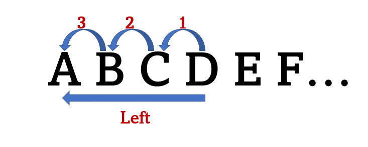
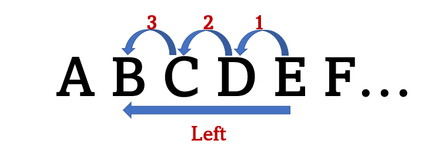

# **PROJECT QUESTION**
The IT team needs to comply with the companies' policies on data privacy. Your boss tasks you to write an algorithm to encrypt and decrypt its internal messages using Caesar cipher.

# INTRODUCTION
In cryptography, a `Caesar cipher`, also known as a `Shift Cipher`, is one of the simplest and most widely known encryption techniques. It is a type of substitution cipher in which each letter in the plaintext is replaced by a letter of some fixed number positions down the alphabet.

The method is named after Julius Caesar, who used it in his private correspondence.

For example, with a left shift of 3;
- D would be replaced by A

- E would become B, and so on.

Decryption is done in reverse with a right shift of 3

# Encryption and Decryption Process
## **Step 1**
Importing the `string` module

    import string

The module contains but not limited to lowercase and uppercase alphabet and punctuations (characters). This strings are required for mapping to each letter or character of user input and shifting the user input to form a new encrypted message or, decrypt the encoded message to its original form.

[Check string documentation for more details on the module](https://docs.python.org/3/library/string.html)

## **Step 2**
Defining (creating) the encryption and decryption cipher functions

Pass the following parameters into the functions:
- text: The plain text you want to encrypt or decrypt
- shift: The number of positions you want to shift the encoded or decoded message
- alphabets: The alphabets both lower and upper from the string module (ascii_lowercase, ascii_uppercase)
- characters: The punctuation from the string module (punctuation)

## Encryption function
        def encrypt_cipher(text, shift, alphabets, characters):

## Decryption function
        def encrypt_cipher(text, shift, alphabets, characters):

## **Step 3**
Since the length of alphabets(26 each for lowercase and uppercase) is not equal to that of the characters(32); two functions need to be defined within the main cipher function to slice the alphabets and/or characters.

The alphabets and punctuation are sliced at the number specified, of positions one wants to shift them and appended to the end of the remaining alphabets or characters

## Define the function to shift alphabets
To ensure that function still works when input of shift number is higher than length of either strings of alphabet; the modulo operation is used with length of either string of lowercase or uppercase alphabet (26)

The functions also needs to account for direction i.e., to shift either left or right when prompted by user for both alphabets and characters

    def shift_alphabet(alphabet):
            if shift_direction.lower() == 'left':
                return alphabet[(26-(shift%26)):] + alphabet[:(26-(shift%26))]
            elif shift_direction.lower() == 'right':
                return alphabet[(shift%26):] + alphabet[:(shift%26)]

## Define the function to shift punctuation (characters)
Perform the same operations as in function to shift alphabets but changing the length since the punctuation string has length of 32

The function specifies that characters are shifted only if user specifies that they also want to shift them, else are not shifted and kept as they are.

    def shift_character(character):
        if shift_char.lower() == 'yes' or shift_char.lower() == 'y':
            if shift_direction.lower() == 'left':
                return character[(32-(shift%32)):] + character[:(32-(shift%32))]
            elif shift_direction.lower() == 'right':
                return character[(shift%32):] + character[:(shift%32)]
        elif shift_char.lower() == 'no' or shift_char.lower() == 'n':
            return character[0:] + character[:0]

## **Step 4**
After applying the functions to each item of either strings of alphabet and/ or characters (punctuation), concatenate the results to form new string and the new shifted string after iteration within a tuple using the map class

**The map() function returns a map object (an iterator) of the results**

**The maketrans() method returns a mapping table that can be used with the translate() method to replace each item of the concatenated new string with the corresponding item in the same position in the new shifted string**

    shifted_alphabets = tuple(map(shift_alphabet, alphabets))
    final_alphabet = ''.join(alphabets)
    final_shifted = ''.join(shifted_alphabets)
    table = str.maketrans(final_alphabet, final_shifted)

    shifted_characters = tuple(map(shift_character, characters))
    final_character = ''.join(characters)
    final_shifted_char = ''.join(shifted_characters)
    table_char = str.maketrans(final_character, final_shifted_char)
    return text.translate(table).translate(table_char)

## **Step 5**
## Prompt user to input message and required specifications for encryption or decryption before calling the function
- plain_text: The message you want encrypted or decrypted
- shift_char: Whether your message has characters and if so, whether or not you want to shift them or; whether or not they were shifted during encryption
- shift: The number of positions you want to shift the message or the number of positions the message was shifted during encryption
- shift_direction: Specify the direction you want the message shifted or, the opposite of the direction specified to shift the message during encryption; in the case of decryption `(i.e., left, if during encoding the text was shifted right and viceversa)`

## **Step 6**
## Call the function and pass all the arguments the function expects to receive
### **When called, the encryption cipher function returns encrypted message**

    print('ENCRYPTED MESSAGE: ', encrypt_cipher(plain_text, shift, [string.ascii_lowercase, string.ascii_uppercase], [string.punctuation]))

### **When called, the decrytion cipher function returns decrypted message**

    print('DECRYPTED MESSAGE: ', decrypt_cipher(plain_text, shift, [string.ascii_lowercase, string.ascii_uppercase], [string.punctuation]))

## And we're done 😃
---